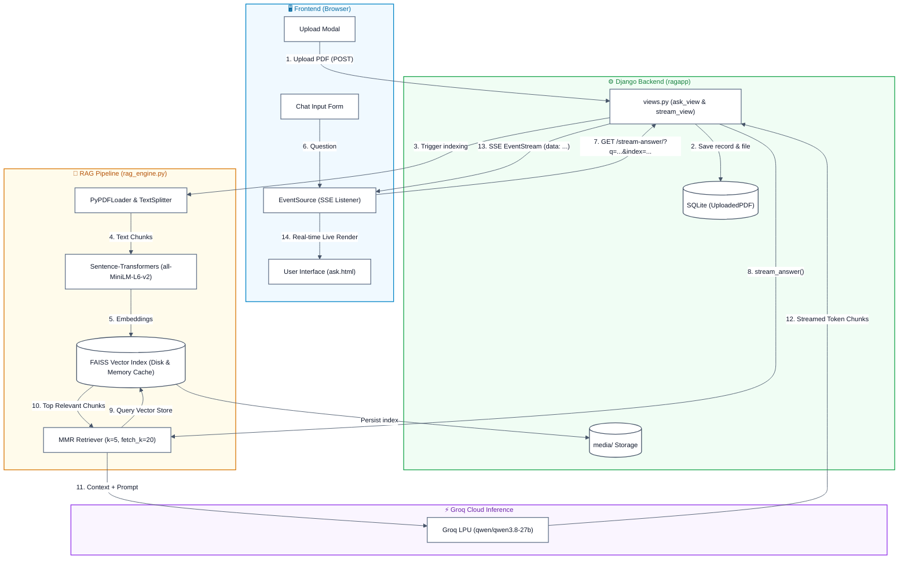

# RAG PDF Q&A System

A high-performance web application that lets you upload a PDF and ask natural-language questions about it — powered by a hybrid Retrieval-Augmented Generation (RAG) pipeline combining local document embedding (Sentence-Transformers + FAISS) with ultra-fast cloud LLM inference via **Groq** (`qwen/qwen3.8-27b`).

Features real-time token streaming via Server-Sent Events (SSE), instant boot times, and a lightweight memory footprint (~300 MB RAM) suitable for free-tier cloud deployment on platforms like Render.

---

## Architecture Diagram



---

## Features

- **Browser-Based PDF Upload**: Upload documents through a Bootstrap modal with active state management.
- **Smart Upload Protection**: Automatically disables upload controls when a document is currently active and provides a single-click **🗑 Remove PDF** button.
- **Local Embedding & Vector Search**: Document chunking and vector similarity search run locally using FAISS and MiniLM embeddings.
- **Maximal Marginal Relevance (MMR)**: Context retrieval selects diverse, non-redundant passages (`k=5`, `fetch_k=20`, `lambda_mult=0.7`) to prevent repetitive context.
- **Blazing-Fast Groq Inference**: Generates answers in seconds using Groq's high-speed LPU infrastructure (`qwen/qwen3.8-27b`).
- **Real-Time Token Streaming**: Server-Sent Events (SSE) stream answers token-by-token directly into live bullet points.
- **Lightweight & Cloud-Ready**: Low RAM usage (~300 MB) enables free-tier deployment on cloud platforms like **Render**.

---

## Tech Stack

| Layer | Technology | Description |
|---|---|---|
| **Backend Framework** | Django 5.2 | Web framework and API endpoints |
| **PDF Parsing** | `pypdf` | Extracts raw text from uploaded PDF files |
| **Text Chunking** | `RecursiveCharacterTextSplitter` | Chunks text (700 characters, 150 overlap) |
| **Embeddings** | `sentence-transformers/all-MiniLM-L6-v2` | Generates 384-dimensional dense vector embeddings |
| **Vector Store** | FAISS (`faiss-cpu`) | In-memory similarity search with local disk persistence |
| **Language Model** | Groq API (`qwen/qwen3.8-27b`) | High-speed generative model (configurable via `.env`) |
| **Real-time Streaming** | Server-Sent Events (SSE) | Django `StreamingHttpResponse` + JS `EventSource` |
| **Orchestration** | LangChain Core & Community | Document loaders, vector stores, and retrievers |

---

## How It Works

### 1. Ingestion Pipeline
1. **Upload**: User submits a PDF file through the modal.
2. **Parsing & Chunking**: `PyPDFLoader` reads document text, and `RecursiveCharacterTextSplitter` splits it into manageable overlapping chunks.
3. **Embedding**: `all-MiniLM-L6-v2` converts chunks into vector representations.
4. **Indexing**: Chunks and vectors are indexed in FAISS, saved to `media/vectorstores/<uuid>/`, and cached in memory.

### 2. Query & Generation Pipeline
1. **Ask a Question**: User enters a query; JavaScript initiates an `EventSource` connection to `/stream-answer/?q=...&index=...`.
2. **Context Retrieval**: MMR retriever fetches the top 5 most diverse, relevant chunks from the FAISS vector store.
3. **Prompt Construction**: Grounded system prompt injects retrieved context and instructs the model to produce concise bullet points.
4. **Live Streaming**: Groq streams tokens back through Django's SSE endpoint, rendering line-by-line in the browser.

---

## Setup & Installation

### 1. Clone the Repository
```bash
git clone https://github.com/1811kushald/Local_RAG_PDF_Q-A_System.git
cd Local_RAG_PDF_Q-A_System
```

### 2. Create Virtual Environment & Install Dependencies
```bash
python -m venv venv
venv\Scripts\activate       # On Windows
# source venv/bin/activate  # On macOS/Linux

pip install -r requirements.txt
```

### 3. Configure Environment Variables
Copy the example environment file and configure your Groq API key:
```bash
cp .env.example .env
```
Edit `.env`:
```env
GROQ_API_KEY=gsk_your_actual_groq_api_key_here
GROQ_MODEL=qwen/qwen3.8-27b
```
*(Get a free Groq API key at [console.groq.com/keys](https://console.groq.com/keys)).*

### 4. Run Migrations
```bash
python manage.py migrate
```

### 5. Start the Server
```bash
python manage.py runserver
```

### 6. Open in Browser
Visit:
```
http://localhost:8000/
```

---

## Project Structure

```
ragsite/
├── manage.py
├── requirements.txt         # Project dependencies
├── .env.example             # Template environment variables
├── .env                     # Local secrets (API keys)
├── db.sqlite3               # SQLite database
├── media/                   # Uploaded PDFs and FAISS vector stores
│   ├── pdfs/
│   └── vectorstores/
├── ragsite/                 # Django project configuration
│   ├── settings.py          # App settings, media config, .env loader
│   ├── urls.py              # Root routing
│   └── wsgi.py
└── ragapp/                  # Core application
    ├── apps.py              # Preloads embedding model at startup
    ├── models.py            # UploadedPDF model definition
    ├── views.py             # ask_view (Upload/Ask/Remove) & stream_view (SSE)
    ├── rag_engine.py        # Embeddings, FAISS indexing, Groq streaming
    ├── urls.py              # App routes ('/' and '/stream-answer/')
    ├── static/ragapp/       # CSS stylesheets
    └── templates/ragapp/
        └── ask.html         # Main UI with modal & SSE event listener
```

---

## Deployment to Render

This application is ready for deployment on **Render** (free tier):

1. Push your code to GitHub.
2. In Render, create a new **Web Service** connected to your repository.
3. Configure settings:
   - **Environment**: `Python 3`
   - **Build Command**: `./build.sh`
   - **Start Command**: `gunicorn ragsite.wsgi:application`
4. Add Environment Variables in the Render dashboard:
   - `GROQ_API_KEY`: Your Groq API key
   - `GROQ_MODEL`: `qwen/qwen3.8-27b`
   - `PYTHON_VERSION`: `3.12.0`

---

## Future Improvements

- Support multiple documents per user with authentication
- Optional persistent cloud storage (AWS S3) for uploaded media
- Support for additional document types (.docx, .txt, .csv)
- Conversation history / multi-turn chat memory
